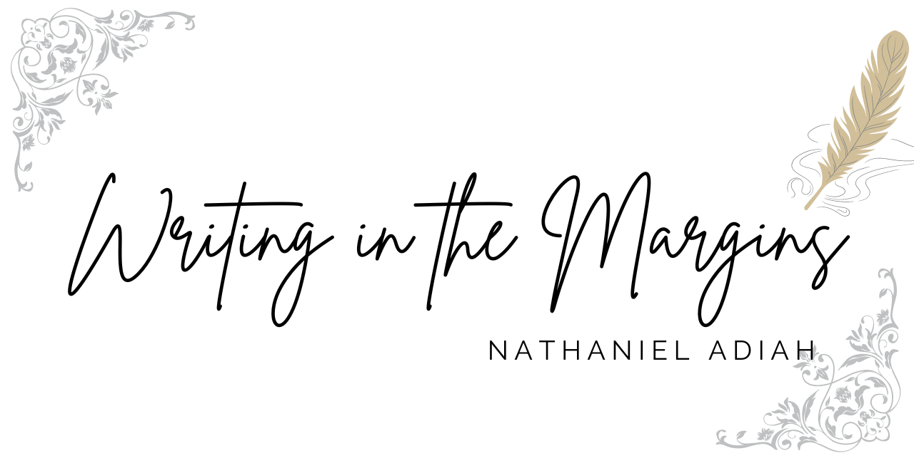

# Writing in the Margins

_A blogging webapp for my writing projects._

I set out to build a web application from scratch that I could be proud of as a programming project as well as be functional for me to actually use.

I'm going to start this with purely django. In the future I may link it to a React frontend.
